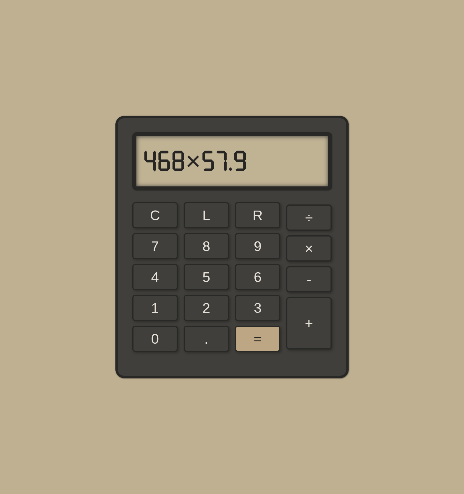

# Physical Calculator

## 👨‍💻 Über das Projekt

Ein schöner und schlichter Taschenrechner für kleine Rechenaufgaben. Addition, Subtraktion, Multiplikation und Division werden unterstützt. Das Design erinnert an einen echten, kleinen Taschenrechner. Es gibt außerdem einen Modus mit Beleuchtung der Tasten und des Displays. Entwickelt mit CSS, HTML und JavaScript.

---

> **Physical Calculator**  
> WebByte Studio